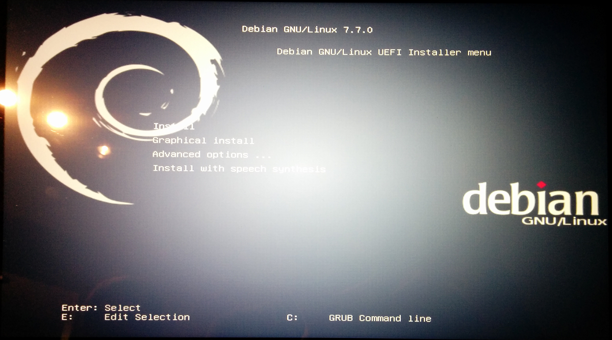
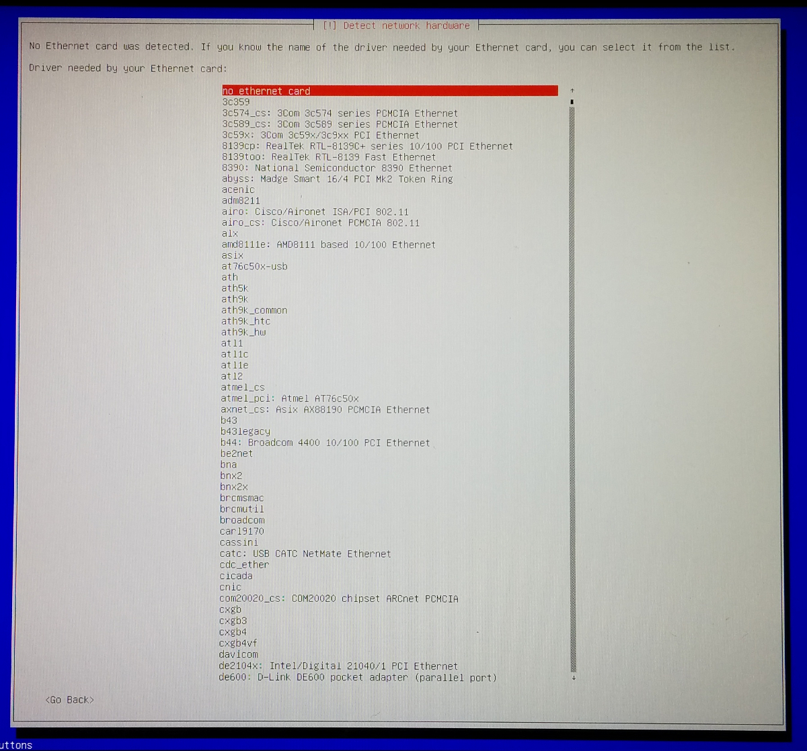
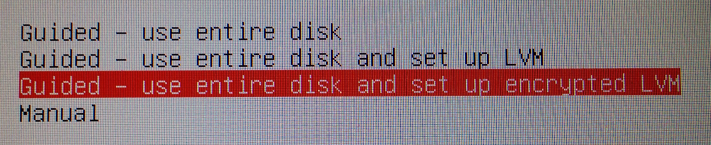
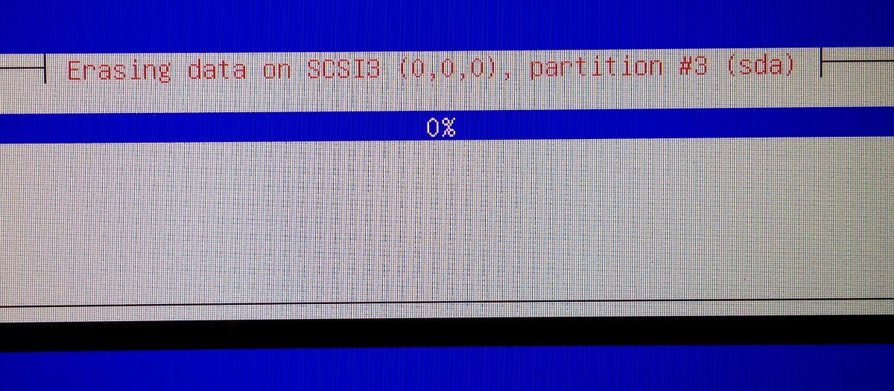

## Installing Debian 7 on a Dell XPS

Notes from me, [Eric Mill](https://twitter.com/konklone) as I installed Debian for the first time, onto a new laptop, with sage advice and spiritual guidance from [Paul Tagliamonte](https://twitter.com/paultag).

### You Will Need

**A computer.** I am using a Dell XPS 13, purchased through the Dell Ubuntu program:

> http://dell.com/ubuntu

The Dell Ubuntu program is managed by a friendly, competent team of Linux-friendly folk inside Dell who ensure that your computer will Just Work with Linux. The Dell XPS is used by multiple Debian team members, so your pain points will be theirs, and they will fix things.

Supporting Dell's program is a wonderful thing to do, and it's also just a **great goddamned laptop**.

**The Debian testing ISO.** Avi Kelman kindly maintains [a pointer to the version of Debian you probably want at [The Debian Gotham Needs](https://fiendish.github.io/The-Debian-Gotham-Needs/).

It links you to a directory, which has one `.iso` file to download. When I did this, that was `firmware-7.7.0-amd64-netinst.iso`.

It's the 64-bit version, with **non-free software enabled** (so that your wireless card will work). You can certainly go with other install paths for Debian. I elected to use the one I thought would give me the least trouble during the install process.

**A USB drive** with at least 1 GB of space.

**A USB network connection.** Like a smartphone that can tether a WiFi connection over USB, or a USB WiFi stick.


### Preparing to Install Debian

Flash the USB drive. From Ubuntu:

* Find the device ID: it will probably look like `/dev/sdb`.
* If the ISO has been renamed to `debian.iso`, and the device is `/dev/sdb`, run:

```bash
sudo dd if=debian.iso of=/dev/sdX
```

* Reboot the computer.
* On boot, **go into the BIOS** by pressing F2 while the Dell logo appears.
* Go to the `Boot Options` menu, go to the `Boot List Options` option, and switch it to UEFI Mode.
* **Warning:** After you turn on UEFI mode, you will not be able to boot back into whatever you were coming from (e.g. if you change your mind), unless you return here and switch this option back to Legacy Boot.
* Reboot the machine by saving and exiting the BIOS.
* On boot, **go into Boot Options** by pressing F2 while the Dell logo appears.
* Select the USB drive under the UEFI section.

You should soon see the Debian install screen pop up.

### Installing Debian

You should be at the graphical installer screen.

* Pick the top option, `Install`:



* Choose your language (e.g. `English`), and your country (e.g. `United States`).

* It will try to find a network connection. Maybe it'll work with your WiFi, but it failed for me:



* Plug in your USB network connection. Hit `Tab` to highlight `Go Back`, then hit `Enter` to return to this screen, and select `Retry Network`:


* Then enter your hostname, which is essentially your computer name (mine was `erictop`).
* When it asks for a domain name, leave it blank and hit Enter.
* Enter a password for the `root` user, and verify the password.
* Enter your full name (e.g. `Eric Mill`).
* Enter a username (e.g. `eric`).
* Enter a password for that user, and verify that password.
* Pick your time zone.

### Setting up your disk

Now you'll be asked about disk stuff. This can be intimidating, but don't worry about it.

I'm going for **full disk encryption**. The Debian installer makes this super easy. The downsides are:

* You'll enter a password when you boot your computer up, or resume from hibernation. (Not from ordinary sleep.)
* Can add some slight latency on some kinds of disk writes. This isn't a common problem, and you shouldn't notice much of anything in practice.
* Will make the _install_ process take a couple hours, as it first erases every block of the disk.

The upside is your **entire disk is goddamn encrypted**, which makes you more safe from attackers the world over. And **it's so easy**: besides the boot password, there's no impact on usability. I strongly recommend it.

* To encrypt, go with the third option:



* Just put everything on one partition.
* It will ask you to confirm which disk you want to encrypt and write Debian to. Make sure you pick your actual hard drive, not the USB flash drive.


* It'll ask you to really confirm what you're about to do:


* Then prepare for the disk erasing to take a long time.



